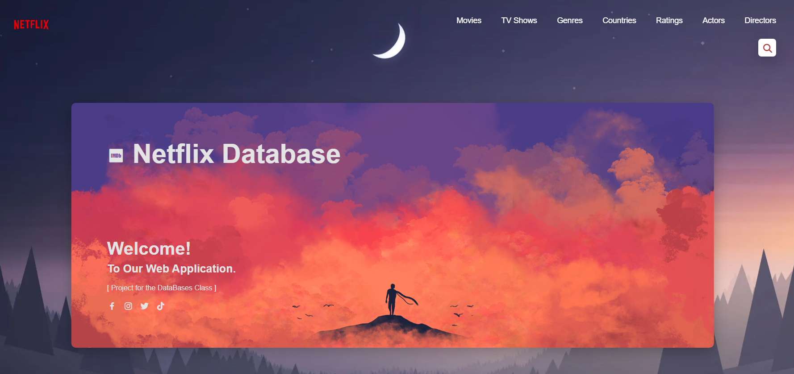

<div align="center">
    <h1>Netflix Web Application</h1>
</div>

<p align="center" width="100%">
    
</p>

## Descrição da Aplicação
**Aplicação Web** para o acesso a dados dos *Shows* da Netflix a partir de uma Base de Dados.

## Descrição dos Diretórios

### [Data-Preparation](/Data-Preparation/)
No Diretório `Data-Preparation` encontram-se tanto o Dataset selecionado ( [**netflix_titles.csv**](/Data-Preparation/netflix_titles.csv) ) bem como o script ( [**Netflix DataSet - Data Preparation**](/Data-Preparation/Netflix%20DataSet%20-%20Data%20Preparation.ipynb) ) utilizado na criação e modelação da Base de Dados.

Mais ainda, este apresenta um outro diretório ( [Output_Tables](/Data-Preparation/Output_Tables/) ) onde se encontram as várias tabelas ( **já povoadas** ) do modelo relacional,  guardadas em **formato .csv**.

### [Web-Application](/Web-Application/)
No Diretório `Web-Application` encontram-se os vários ficheiros responsáveis pela execução da Aplicação que, juntamente com a Base de Dados ( **Netflix.db** ) e os vários templates utilizados ( Presentes em [**templates**](/Web-Application/templates/) ), irão integrar a **Aplicação Web**.

## Dependências / Pré-Requisitos

De forma a conseguir executar e utilizar esta aplicação deve certificar-se que a sua máquina obedece às seguintes **dependências**:

- [Python 3](#python3-e-pip)
- [Gestor de Pacotes pip](#python3-e-pip)
- [Bibliotecas Python](#bibliotecas-python)

### Python3 e Pip 

Caso não tenha o Python 3 ou o Gestor de Pacotes pip instalados, pode fazê-lo [em **Ubuntu**] através do comando:

```
sudo apt-get install python3 python3-pip
```

### Bibliotecas Python

Mais ainda, deve certificar-se que tem instalado as bibliotecas necessárias. Para tal basta executar:

```
pip install -r requirements.txt
```

####  Referências

- [Flask](https://flask.palletsprojects.com/en/2.0.x/)
- [Jinja templates](https://jinja.palletsprojects.com/en/3.0.x/)

## Execução

Inicie a aplicação executando `python3 server.py` e interaja com a mesma
abrindo uma janela no seu browser com o endereço [**http://127.0.0.1:9001/**](http://127.0.0.1:9001/).

<p align="center" width="100%">
    
</p>

# Considerações Finais

Se existir alguma **dificuldade** no download ou execução da aplicação não hesite em contactar-nos:
- **Via email**: 
    - [Gonçalo Esteves](https://github.com/EstevesX10) - `up202203947@up.pt`
    - [Nuno Gomes](https://github.com/NightF0x26) - `up202206195@up.pt`